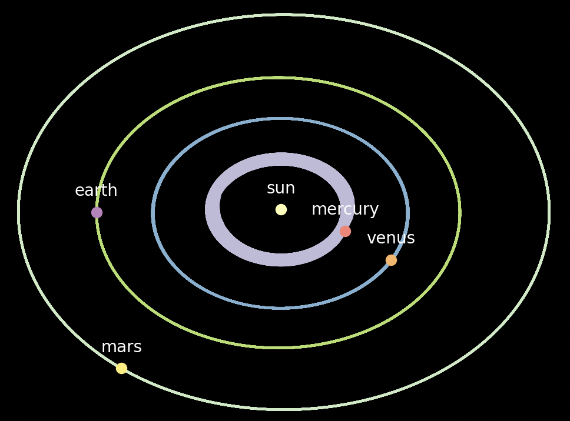

2d Planetary and Satellite Motion Simulator
===========================================
***Python TKinter visualisation of a collection of masses according to Newton's law of gravitation.***

Satellite class: Create satellites with initial masses, positions, velocities, and accelerations.

Solarsystem class : A group of satellites, with the ability to step time with the update() function.

visuals.py gives an animated example with a collection of planets from our local solar system.
